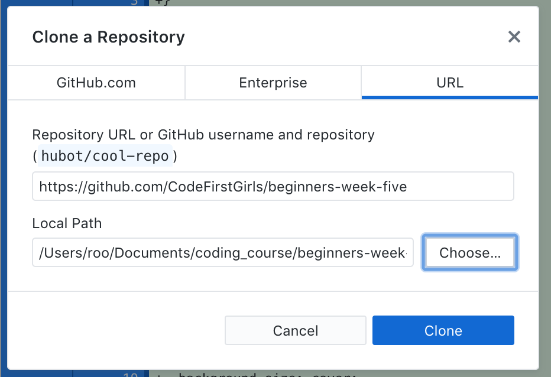

# Day3_Bootstrap
Beginner BOOTSTRAP

Welcome to twitter bootstrap! This is a template website that you will use to experiment with the framework, adding components and adjusting the styles accordingly.

## First Task
- Click on the 'Fork' icon on the top right of the page, and fork it into your github account.
You will now have your own copy of this excercise on your github profile.
- Navigate to your version of this project.
- Click 'clone or download'.
- Select the 'open in desktop' option.
- Clone the repo into your coding_course folder, here is an example:
- Open the folder in Visual Studio Code.

## Second Task
Link the bootstrap CSS into your HTML.

You can find this by looking for the CDN link on [Bootstrap.com](https://getbootstrap.com/docs/4.1/getting-started/introduction/)
